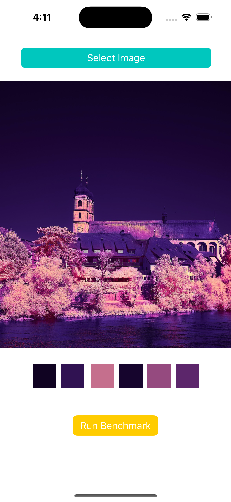

## DominantColor

Finding the dominant colors of an image using the CIE LAB color space and the k-means clustering algorithm.

**This fork fully supports Swift Concurrency.**

### Algorithm

#### Color Space

The RGB color space does not take human perception into account, so the CIELAB color space is used instead, which is designed to approximate human vision [[1]](http://en.wikipedia.org/wiki/Lab_color_space#Advantages). 

##### Conversion from RGB

The conversion from RGB values to LAB values requires first transforming the RGB values to an absolute color space like sRGB[[2]](http://en.wikipedia.org/wiki/Lab_color_space#RGB_and_CMYK_conversions). On iOS, this conversion is not necessary because sRGB is the native device color space[[3]](https://developer.apple.com/library/ios/documentation/GraphicsImaging/Reference/CGColorSpace/index.html). On OS X, the conversion can be performed using [`-[NSColorSpace sRGBColorSpace]`](https://developer.apple.com/library/mac/documentation/Cocoa/Reference/ApplicationKit/Classes/NSColorSpace_Class/index.html).

Once the colors have been converted to sRGB, they are first converted to linear sRGB values and then to CIE XYZ values[[4]](http://en.wikipedia.org/wiki/SRGB#The_forward_transformation_.28CIE_xyY_or_CIE_XYZ_to_sRGB.29). Finally, they are converted to the CIE LAB color space[[5]](http://en.wikipedia.org/wiki/Lab_color_space#CIELAB-CIEXYZ_conversions) using a D65 standard illuminant[[6]](http://en.wikipedia.org/wiki/Illuminant_D65)[[7]](http://www.easyrgb.com/index.php?X=MATH&H=15#text15). 

#### Color Difference

A color difference algorithm is used to group similar colors. API consumers can choose between the CIE 76[[8]](http://en.wikipedia.org/wiki/Color_difference#CIE76), CIE 94[[9]](http://en.wikipedia.org/wiki/Color_difference#CIE94), and CIE 2000[[10]](http://en.wikipedia.org/wiki/Color_difference#CIEDE2000) algorithms for low, medium, and high color grouping accuracy, respectively. The default algorithm is CIE 94, as it provides results that are close to CIE 2000 with a negligible performance impact in comparison to CIE 76.

#### Clustering (k-means)

Pixels are grouped into clusters of dominant colors using a standard k-means clustering algorithm[[11](http://en.wikipedia.org/wiki/K-means_clustering)][[12](http://users.eecs.northwestern.edu/~wkliao/Kmeans/)][[13](http://cs.smu.ca/~r_zhang/code/kmeans.c)]. 

##### Choosing K

The k-value was originally chosen based on the rule of thumb `k = sqrt(n/2)`[[14](http://en.wikipedia.org/wiki/Determining_the_number_of_clusters_in_a_data_set#cite_note-1)] but this resulted in `k`-values that were too large to run in a reasonable amount of time for large values of `n`. Right now, I'm using a magic value of `16` because empirical testing showed that it yielded the best results for many different images but I'm still looking into a number of more data-driven alternate approaches.

##### Selecting Initial Centroids

The initial centroids are currently selected on a random basis. An alternative approach is to use the [k-means++ algorithm](http://en.wikipedia.org/wiki/K-means%2B%2B), in which after the first centroid is selected randomly, the subsequent centroids are selected with probability proportional to the distance from the randomly selected centroid.

#### Downsampling

The k-means algorithm has a worst case runtime that is super-polynomial in the input size[[15](http://en.wikipedia.org/wiki/K-means%2B%2B)], so sampling large numbers of pixels is a problem. Images are automatically downsampled such that the total number of pixels is less than or equal to a specified maximum number of pixels to sample. The value I've been using is `1000`, which is a good balance between accurate results and runtime. 

### Implementation

Everything is implemented in Swift except for the functions that convert between color spaces, which use GLKit and thus must be written in C (since Swift doesn't support C unions at this time). 

### Apps

The project includes Mac and iOS apps that can be used to see the results of the algorithm and to run a simple benchmark.

### License

Licensed under the MIT License.

### References

1 [http://en.wikipedia.org/wiki/Lab_color_space#Advantages](http://en.wikipedia.org/wiki/Lab_color_space#Advantages)  
2 [http://en.wikipedia.org/wiki/Lab_color_space#RGB_and_CMYK_conversions](http://en.wikipedia.org/wiki/Lab_color_space#RGB_and_CMYK_conversions)  
3 [https://developer.apple.com/library/ios/documentation/GraphicsImaging/Reference/CGColorSpace/index.html](https://developer.apple.com/library/ios/documentation/GraphicsImaging/Reference/CGColorSpace/index.html)  
4 [http://en.wikipedia.org/wiki/SRGB#The_forward_transformation_.28CIE_xyY_or_CIE_XYZ_to_sRGB.29](http://en.wikipedia.org/wiki/SRGB#The_forward_transformation_.28CIE_xyY_or_CIE_XYZ_to_sRGB.29)    
5 [http://en.wikipedia.org/wiki/Lab_color_space#CIELAB-CIEXYZ_conversions](http://en.wikipedia.org/wiki/Lab_color_space#CIELAB-CIEXYZ_conversions)  
6 [http://en.wikipedia.org/wiki/Illuminant_D65](http://en.wikipedia.org/wiki/Illuminant_D65)    
7 [http://www.easyrgb.com/index.php?X=MATH&H=15#text15](http://www.easyrgb.com/index.php?X=MATH&H=15#text15)  
8 [http://en.wikipedia.org/wiki/Color_difference#CIE76](http://en.wikipedia.org/wiki/Color_difference#CIE76)    
9 [http://en.wikipedia.org/wiki/Color_difference#CIEDE2000](http://en.wikipedia.org/wiki/Color_difference#CIE94)    
10 [http://en.wikipedia.org/wiki/Color_difference#CIEDE2000](http://en.wikipedia.org/wiki/Color_difference#CIEDE2000)  
11 [http://en.wikipedia.org/wiki/K-means_clustering](http://en.wikipedia.org/wiki/K-means_clustering)  
12 [http://users.eecs.northwestern.edu/~wkliao/Kmeans/](http://users.eecs.northwestern.edu/~wkliao/Kmeans/)  
13 [http://cs.smu.ca/~r_zhang/code/kmeans.c](http://cs.smu.ca/~r_zhang/code/kmeans.c)  
14 [http://en.wikipedia.org/wiki/Determining_the_number_of_clusters_in_a_data_set#cite_note-1](http://en.wikipedia.org/wiki/Determining_the_number_of_clusters_in_a_data_set#cite_note-1)  
15 [http://en.wikipedia.org/wiki/K-means%2B%2B](http://en.wikipedia.org/wiki/K-means%2B%2B)
